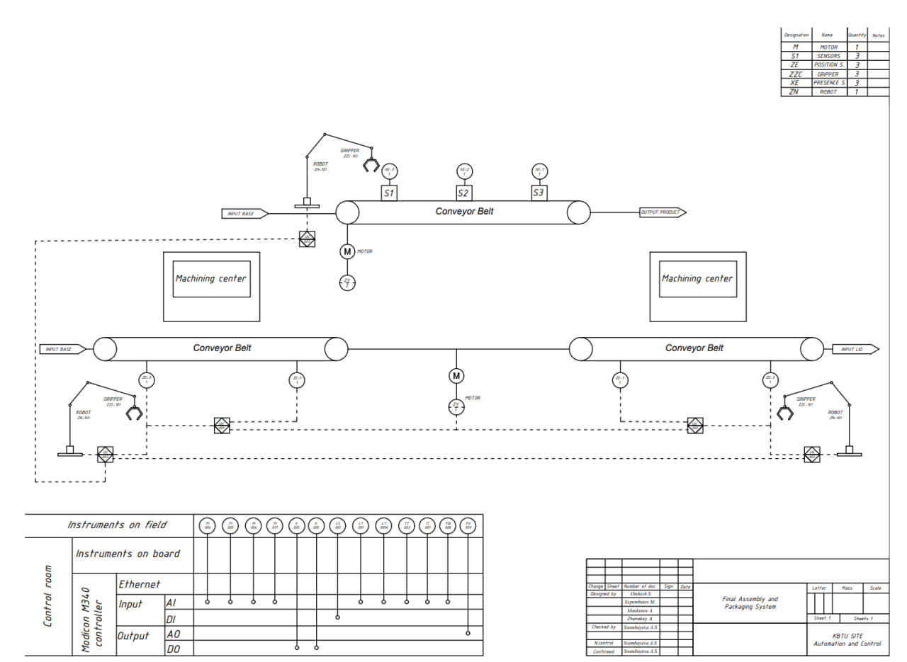

# ⚙️ PLC Control & Software Architecture

The control architecture for the Automated Final Module Assembly & Packaging System is engineered within the Siemens TIA Portal V19 environment using a hybrid structure of Ladder Logic (LAD) for sequential interlocking and Structured Control Language (SCL) for data handling. The modular software design incorporates structured memory allocation and strict naming conventions across discrete networks to manage conveyor indexing, robotic sequencing (Start/Busy/Done handshakes), and digital signal conditioning for presence and position sensors. Operating logic supports both Automatic continuous cycles and Manual axis jogging modes, integrated alongside software watchdogs, timers, and fail-safe routines such as Emergency Stop tracking to ensure rigorous boundary limits and operational safety, all of which were fully validated via real-time simulation prior to deployment.

---

## Technological Scheme & Instrumentation (P&ID Layout)

The diagram illustrates the physical and logical integration of the field instrumentation with the industrial control layer. The system architecture coordinates material flow across multiple processing vectors via a centralized control framework:

* **Control Interface Topology:** The automation backbone relies on a Modicon controller framework acting as the main processor. Field data acquisition and command signaling are routed through an industrial Ethernet network interface. The I/O matrix maps dynamic process variables divided into Digital Inputs (DI) / Digital Outputs (DO) for discrete sequencing, and Analog Inputs (AI) / Analog Outputs (AO) for continuous loops such as tracking machining execution profiles.
* **Actuator and Sensor Field Layer:** * **Material Transport:** The process contains independent `Conveyor Belts` driven by industrial motors (`M`). Component transitions and queuing are regulated by localized tracking groups, specifically presence switches (`S1`, `S2`, `S3`) and dedicated alignment loops.
 

 * **Handling & Manipulation Blocks:** Three robotic handling units (`ROBOT ZN-101`) equipped with pneumatic or electric end-effectors (`GRIPPER ZZC-101`) manage cross-conveyor pick-and-place loops. These units execute trajectories based on interlocked feedback from position tracking sensors (`ZE`).
  * **Processing Stations:** Integrated `Machining Centers` receive synchronized material blocks from the conveyor lines, executing local processing parameters before releasing components back into the active transport loop.
---

## 🔢 PLC Input/Output (I/O) Mapping & Tag Assignment

The following tables define the complete I/O variable allocation and internal memory mapping compiled within the Siemens TIA Portal tag table.

### 1. Digital Inputs (%I)
These memory registers process raw signals arriving from physical switches, push buttons, limits, and field sensors.

| Tag Name | Data Type | Address | Description / Function |
| :--- | :--- | :--- | :--- |
| **Start** | Bool | `%I0.0` | Main sequence initialization command. |
| **Stop** | Bool | `%I0.1` | Controlled process interrupt command. |
| **Base_Detector** | Bool | `%I0.2` | Input sensor tracking the presence of components at the base station. |
| **Base Clamped** | Bool | `%I0.3` | Confirmation limit for the base fixing actuator. |
| **Base_Clamp_Raised** | Bool | `%I0.4` | Upper-limit switch confirmation for the vertical base clamp. |
| **Lid_Detector** | Bool | `%I0.5` | Input sensor detecting lid components. |
| **Lid Clamped** | Bool | `%I0.6` | Confirmation limit for the lid fixing actuator. |
| **Gripper_Moving_X** | Bool | `%I0.7` | X-axis travel confirmation feedback for the manipulator. |
| **Gripper Moving Z** | Bool | `%I1.0` | Z-axis vertical travel confirmation feedback. |
| **Gripper-Touched lid** | Bool | `%I1.1` | Dynamic feedback validating tactile contact with the lid object. |
| **Product Detector** | Bool | `%I1.2` | Optical or proximity tracking flag for assembled parts. |
| **Collection Box Limit** | Bool | `%I1.3` | End-of-travel limit switch monitoring the storage layout. |
| **Turntable Back Limit** | Bool | `%I1.4` | Return position validation flag for the sorting turn unit. |
| **Turntable Front Limit** | Bool | `%I1.5` | Forward-stroke validation limit for the sorting turn unit. |
| **Turntable Limit 90** | Bool | `%I1.7` | Angular alignment feedback flag (90-degree lock position). |
| **E-Stop** | Bool | `%I3.1` | Hardwired safety interlock circuit feedback. |
| **Machining_Center_1_Progress** | Real | `%ID30` | Analog/numerical execution track (0.0 - 100.0%) from the unit. |

### 2. Digital Outputs (%Q)
These hardware addresses drive the physical actuators, solenoid valves, and indicator states across the line.

| Tag Name | Data Type | Address | Connected Actuator / Indicator |
| :--- | :--- | :--- | :--- |
| **Base_Material_emitter** | Bool | `%Q3.0` | Part sourcing actuator command (Base supply unit). |
| **Lid_Material_Emitter** | Bool | `%Q0.1` | Part sourcing actuator command (Lid supply unit). |
| **Base_Clamp** | Bool | `%Q0.2` | Solenoid driver activating the physical base locking hardware. |
| **Lid_Output_Conveyor** | Bool | `%Q0.3` | Motor starter coil for the lid feed belt section. |
| **base Clamp Raise** | Bool | `%Q0.4` | Direct pneumatic or electric lift command for the clamp unit. |
| **Lid_Clamp** | Bool | `%Q0.5` | Solenoid driver activating the lid lock assembly. |
| **Bottle Output Conveyor** | Bool | `%Q0.6` | Motor starter coil for the secondary transport belt. |
| **Product_Output_Conveyor** | Bool | `%Q0.7` | Main drive command for the final delivery conveyor line. |
| **Collection_Box_emitter** | Bool | `%Q1.0` | Emitter gating system output for storage boxes. |
| **Gripper-Move X** | Bool | `%Q1.1` | Direction control output driving the manipulator on the horizontal axis. |
| **Gripper-Move Z** | Bool | `%Q1.2` | Motion control output driving the manipulator on the vertical axis. |
| **Gripper-Grab** | Bool | `%Q1.3` | Solenoid output triggering the vacuum or mechanical jaw grip. |
| **Turntable Roll(+)** | Bool | `%Q1.4` | Forward rotation control relay for the sorting unit. |
| **Turntable Turn** | Bool | `%Q1.5` | Angular displacement tracking drive for the turntable base. |
| **Turntable Roll(-)** | Bool | `%Q1.6` | Reverse rotation control relay for the sorting unit. |
| **Fault** | Bool | `%Q3.2` | Visual alarm light panel or audio indicator activation. |
| **Tag_2** | Bool | `%Q4.0` | Auxiliary system execution output bit. |

### 3. Internal System Memory (%M / %MW)
Internal software registers mapping states, inter-block handshakes, and numerical operations.

| Tag Name | Data Type | Address | Internal Logical Allocation |
| :--- | :--- | :--- | :--- |
| **Base Aligned** | Bool | `%M0.1` | Logical status tracking the physical positioning of the base element. |
| **Lid Aligned** | Bool | `%M0.2` | Logical status tracking the physical positioning of the lid element. |
| **Lid Grabbed** | Bool | `%M0.3` | Step verification bit showing the manipulator successfully locked onto the lid. |
| **Lid Above 'Lid Clamp'**| Bool | `%M0.4` | Spatial verification bit used in collision avoidance networks. |
| **Lid Above Base** | Bool | `%M0.5` | Spatial verification bit validating pick-and-place step accuracy. |
| **Product Assembled** | Bool | `%M0.6` | End-of-cycle confirmation bit triggers the final packaging transfer. |
| **Emitter** | Bool | `%M0.7` | Interlock memory flag gating feed automation steps. |
| **Machining_Center_Light** | Bool | `%M2.1` | Status bit tracking local HMI color indicators for the process matrix. |
| **Start Button** | Bool | `%M20.0` | Software mirror bit generated by the HMI panel input terminal. |
| **Tag_1** | Bool | `%M3.0` | Transient state sequencer flag. |
| **Counter** | Int | `%MW1` | Integer register accumulating the total quantity of completed parts. |
