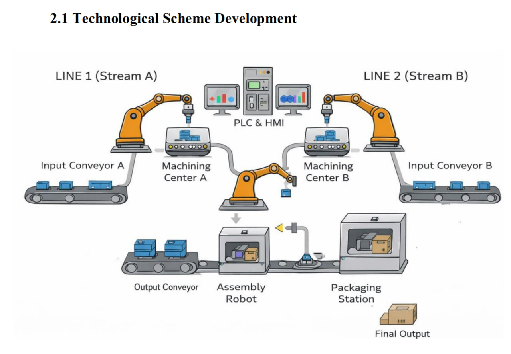

# PLC Logic 

The control logic for the Automated Final Module Assembly & Packaging System was developed using Siemens TIA Portal (Totally Integrated Automation Portal) V19. The PLC program was implemented using Structured Control Language (SCL) and Ladder Logic (LAD), enabling modular, readable, and maintainable code. Key functions—including conveyor control, robotic sequencing, sensor feedback handling, interlocks, and mode selection (automatic/manual)— were structured into networks with clear naming conventions and memory bit management. Timers, set/reset coils, and safety conditions (e.g., emergency stop, start authorization) were integrated to ensure reliable and safe operation. The TIA Portal environment facilitated seamless simulation, online monitoring, and HMI, PLC integration, allowing full validation of the system logic without physical hardware.

