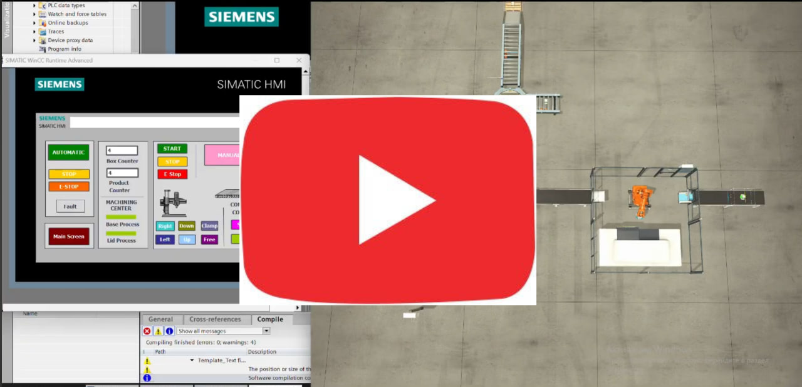

# Assembly and Packaging System
This is my final project for the 'Automated Control Systems Based on Simatic S7-1200' course. Our chosen topic is 'Industrial Automation of a Final Assembly and Packaging System using Siemens SIMATIC S7-1200'.

# 📝Project Description & Goal
## 💡 Why This Project? 

University assignments are great for learning theory, but they rarely show how real factories operate. I wanted to build an automation system that handles actual industrial challenges rather than just passing a basic classroom test. 

I chose to automate a complete assembly and packaging line using a Siemens S7-1200 PLC because it forced me to solve real-world engineering tasks. Programming this sequence required structuring complex state machines, synchronizing multiple conveyors, and managing tight timing interlocks between robotic arms and sensors. It was the best way to test my logic design and see how industrial hardware handles a fast-paced production cycle.

## Project Description

The selected technological process represents a dual-stream automated final assembly and packaging line for electronic modules. Two identical production streams operate in parallel to increase throughput and reduce cycle time variability. Each stream processes one semi-finished module, which is later merged into a single final product.

## 💻 Simulation & Virtual Commissioning (Factory I/O)

It is important to note that this project is implemented as a **full digital simulation** (Virtual Commissioning) rather than being connected to physical industrial machinery. However, the control logic is 100% real: the program runs entirely on a physical **Siemens SIMATIC S7-1200 PLC** and a hardware **HMI panel**.

To bring this simulation to life and make it visually clear, we integrated the system with **Factory I/O**. 

### Why Factory I/O?
* **Real-time 3D Visualization:** It allowed us to build a rich, dynamic 3D smart factory environment that mimics real physical sensors, conveyor belts, and pneumatic actuators.
* **Seamless PLC Integration:** Factory I/O connects directly to our physical S7-1200 PLC via standard Ethernet protocols. This means the PLC "thinks" it is controlling a real factory line, executing our exact ladder/FBD logic.
* **Risk-Free Testing:** It provided a perfect sandbox environment to test complex algorithms, sensor synchronization, and emergency scenarios without the risk of damaging expensive physical hardware.

## Message from the Author

This project represents one of my very first serious milestones as an engineering student diving into the world of industrial automation. 

Since this was developed during my university years, the control logic and architecture might not be 100% perfect, and there is definitely room for optimization. However, every bug encountered and every configuration challenge faced was a massive learning experience. I am sharing this repository openly to document my progress, and I welcome any constructive feedback or suggestions from seasoned automation professionals! 
**If you have any ideas on how to improve or develop this project further, I would love to hear from you! Let's connect on LinkedIn:** 

### 📺 Project Simulation Video

Click the preview image below to watch the full Factory I/O and HMI automation cycle on YouTube:

